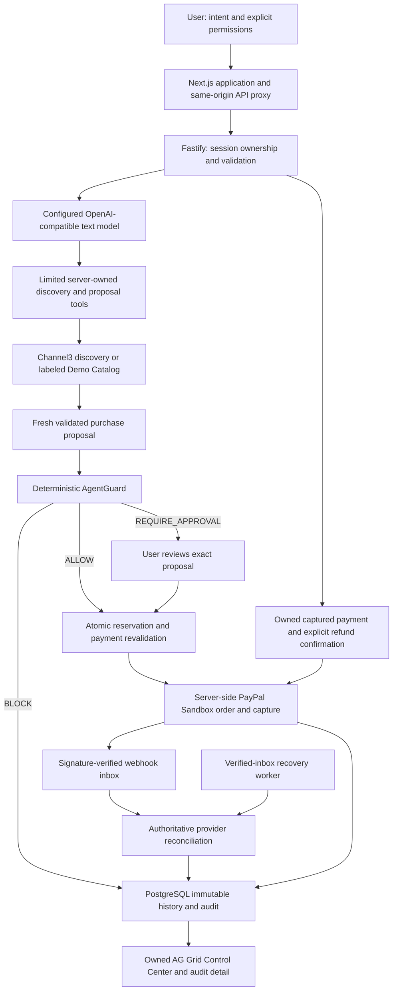

# Application architecture

The AI never receives credentials or unrestricted money movement. AgentGuard decisions, user approvals and PayPal outcomes are independent records. Payment and refund calls leave the database transaction only after an operation is claimed; retries use the stored operation identifiers. Unknown outcomes remain held. The recovery worker performs provider reads and reconciles previously verified events, without creating new financial operations.

The frontend uses the same warm design system across landing, auth, mandates, chat, approvals, checkout, orders and analytics. Dashboard totals use owned, confirmed financial data; loaded-row charts disclose their pagination scope. Order links use payment IDs; proposals without a payment have their own policy/audit detail route.

Deployment is optional and currently deferred. The Render template uses a scheduled recovery job. Render Workflows, AG Studio's Agent Framework, Vault, voice and recurring purchases are separate unimplemented integrations, not substitutes for the working local MVP.
